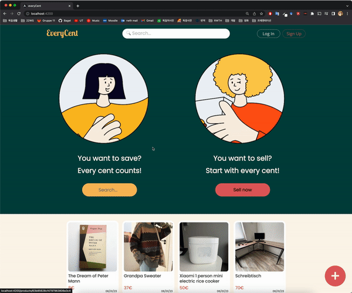
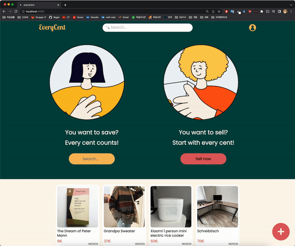

# Gruppe11
 

# EveryCent
- WebApp für Online Flohmarkt

## Technologies
- Frontend: **Angular**
- Backend:  **Node JS**
- Database: **MongoDB**

## Design 

### [Link for Mockup Design ](https://www.figma.com/file/pVUlarB3jvQJ339Hzii7xP/everycent?node-id=79%3A2&t=uLUPgowncZaLY1o9-1)

## Funktionen
### User Verwaltung
- Register
- Login
- Meine Beiträge verwalten

 

### Post Verwaltung
- Create
- Read
- Update
- Delete

 

### Responsive Design
- Web version
- Mobile version

